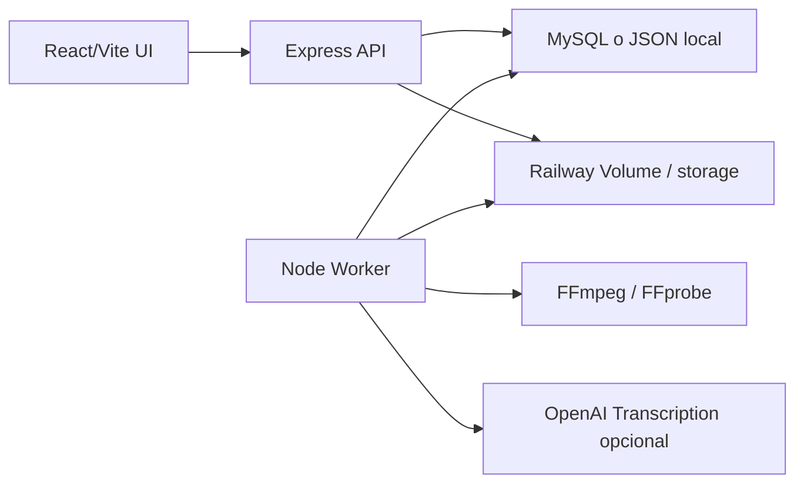

# Arquitectura

## Servicios

## Tablas

- `videos`: metadata del archivo original, proxy y render actual.
- `video_jobs`: cola simple DB-backed.
- `silence_segments`: silencios detectados y accion `cut/keep`.
- `transcript_segments`: texto editable por tiempo.
- `subtitle_cues`: subtitulos con estilo.
- `image_assets`: PNGs y reglas de palabras trigger.
- `timeline_events`: cortes, zooms, overlays manuales y estilos.
- `renders`: historial de exports.

## Worker

El worker reclama un job con `FOR UPDATE SKIP LOCKED` en MySQL. En modo local JSON toma el primer job `queued`.

Procesadores:

- `ingest`: `ffprobe` + proxy 720p.
- `detect_silence`: FFmpeg `silencedetect`.
- `transcribe`: extrae audio y llama OpenAI si hay key.
- `render`: crea cortes, subtitulos ASS, overlays PNG y zooms basicos.

## Deploy recomendado MVP

Un repo, un servicio Railway:

- API + Worker: `npm run start`

`npm run start` importa el servidor y el worker si `RUN_WORKER_IN_WEB=true`, que es el default. Esto mantiene uploads, proxies y renders en el mismo Railway Volume.

Para escalar, separar servicios solo cuando el storage sea compartido por red, como S3/R2:

- Web/API: `RUN_WORKER_IN_WEB=false npm run start`
- Worker: `npm run worker`

Ambos deben compartir `DATABASE_URL` y un storage externo comun.

